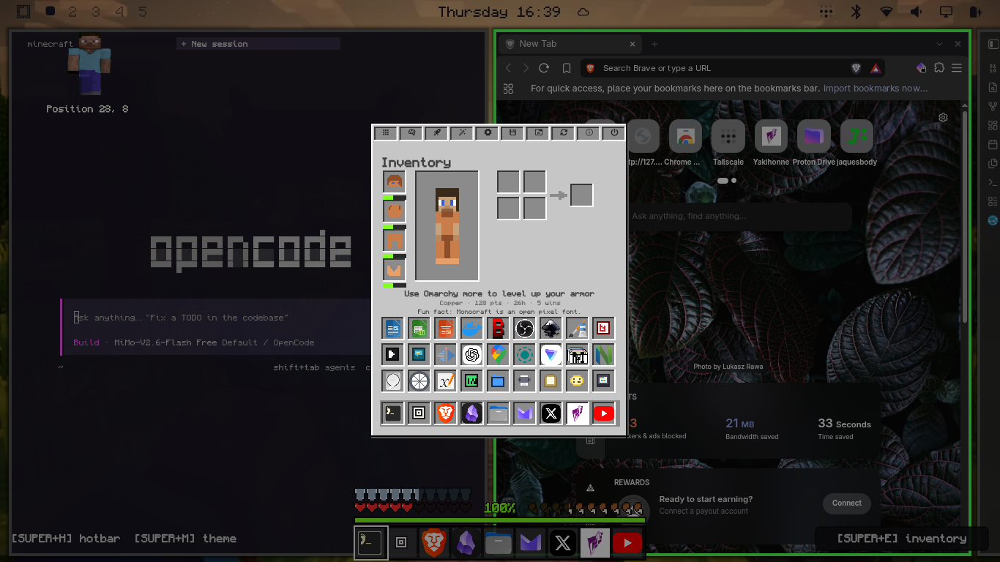
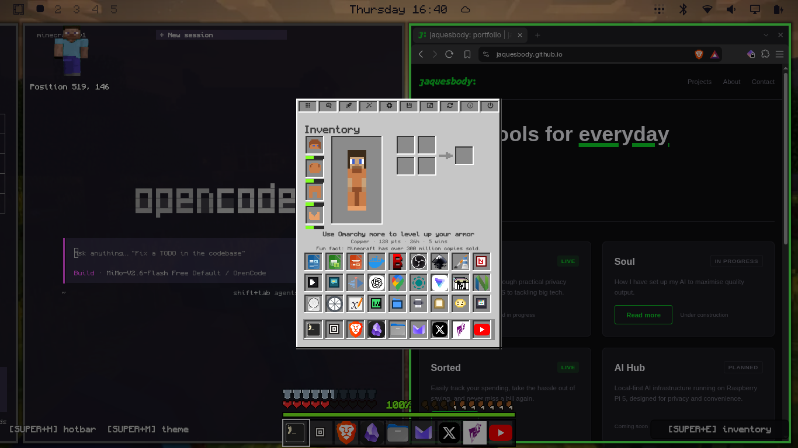
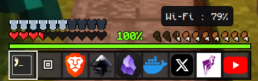
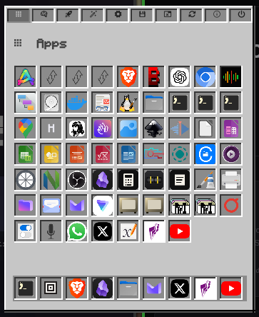
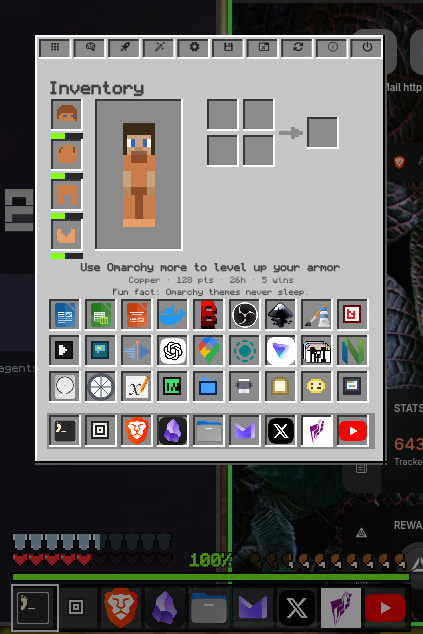

# Minecraft Theme for Omarchy

A switchable Omarchy theme plus a suite of Minecraft-style Quickshell overlays —
all original art, code, and audio. **Not affiliated with Mojang or Microsoft.**

## What you get

| Piece | What it is |
|-------|------------|
| **Theme `minecraft`** | Obsidian palette, XP-green accents, stone GUI greys, Monocraft font, pixel cursor, transparent bar |
| **Bar cube** | Grass-block button beside the Omarchy menu — click to toggle the theme on/off (same as SUPER+M) |
| **HUD (SUPER+H)** | Hotbar, hearts, hunger, XP bar, status icons, bottom-right `[E] inventory` chip |
| **Inventory (SUPER+E)** | Classic GUI with app launchers, category-matched craft-row suggestions |
| **Steve (SUPER+SHIFT+S)** | Blocky companion, top-left; blink + bob; click opens inventory (crouches) |
| **Death power menu (SUPER+SHIFT+D)** | “You Died!” full-screen with Respawn / Title Screen / Log Out / Restart / Shut Down |
| **Toast** | Advancement-style notifications (auto or `minecraft-toast`) |
| **Splash (SUPER+SHIFT+X)** | Yellow diagonal splash text; also fires when the theme turns on |
| **Sounds** | Original procedural click/open/close/toast/death WAVs (CC0) |
| **Screensaver** | Alternating MINEARCHY / OMARCRAFT block art while the theme is on; original branding restored on off. All minecraft panels hide while it runs. |

## Screenshots

| HUD | Inventory |
|-----|-----------|
|  |  |

| Hotbar close-up | Inventory detail |
|-----------------|------------------|
|  |  |



### Demo (145 s)

https://github.com/user-attachments/assets/d87af3de-12f6-44c8-b4cd-ad515e60451c

[Download the mp4](media/omarchy-minecraft-theme.mp4)

## Requirements

- [Omarchy](https://omarchy.org) (tested on 4.0.x / Hyprland 0.56 / Quickshell 0.3)
- Monocraft Nerd Font: `yay -S ttf-monocraft-nerd` then `omarchy font set Monocraft`
- `jq`, `python3`, `pw-play` (WirePlumber) — ship with a normal Omarchy install

## Install

```bash
git clone https://github.com/jaquesbody/omarchy-minecraft-theme.git
cd omarchy-minecraft-theme
./scripts/install.sh
omarchy theme set minecraft
# or press SUPER+M to toggle
```

Idempotent — safe to re-run. Installs theme files, scripts, sounds, cursor,
all six Quickshell plugins, screensaver art, and keybinds into `~/.config/hypr/bindings.lua`.

First time the theme is turned on, a one-time tip appears above the hotbar: `SUPER+M to toggle hotbar on/off`.

## Uninstall

```bash
./scripts/uninstall.sh
```

Restores your previous theme (if Minecraft was active), removes plugins/scripts/sounds/cursor/state.

## Keybinds

| Keys | Action |
|------|--------|
| `SUPER+M` | Toggle theme (on: HUD preloads + splash + toast + screensaver; off: restore) |
| `SUPER+H` | Toggle HUD / hotbar |
| `SUPER+E` | Toggle inventory |
| `SUPER+SHIFT+S` | Toggle Steve |
| `SUPER+SHIFT+D` | Death-screen power menu |
| `SUPER+SHIFT+X` | Show splash text |

## IPC (scripts / automation)

```bash
omarchy-shell shell summon io.github.jaquesbody.minecraft-hud '{"slot":0}'
omarchy-shell shell summon io.github.jaquesbody.minecraft-inventory '{}'
omarchy-shell shell summon io.github.jaquesbody.minecraft-steve '{}'
omarchy-shell shell summon io.github.jaquesbody.minecraft-death '{"score":123}'
omarchy-shell shell summon io.github.jaquesbody.minecraft-toast '{"title":"Hi","subtitle":"there"}'
omarchy-shell shell summon io.github.jaquesbody.minecraft-splash '{"text":"Hello!"}'
minecraft-sound click   # click | open | close | toast | death
```

## Layout

```
theme/          colors, shell, hyprland, neovim, btop, chromium, keyboard, wallpaper
plugin/         Quickshell panels (Hud, inventory, steve, death, toast, splash)
scripts/        install, uninstall, toggles, sound/toast/splash helpers
assets/sounds/  original procedural WAVs (CC0)
cursor/         MinecraftPixel hyprcursor generator + pack
media/          screenshots + demo video (README)
```

## Credits & license

- Code & original art: **MIT** / pixel art & sounds: **CC0** — see `LICENSE`, `CREDITS.md`
- Font: **Monocraft** (SOF OFL) — not bundled; install separately
- Runtime tools (Quickshell, Hyprland, wpctl, …) are invoked, not vendored

**Prohibited:** this repo must never contain official Mojang textures, skins, sounds, or fonts.
